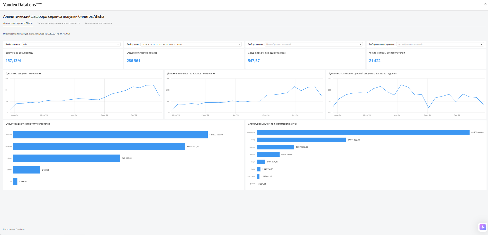

# Yandex DataLens Dashboard

Интерактивный дашборд для анализа бронирований билетов сервиса «Яндекс Афиша».

## Основные показатели

- выручка за период;
- количество заказов;
- средняя выручка с заказа;
- число уникальных покупателей;
- динамика показателей по неделям;
- структура выручки по устройствам и типам мероприятий.

## Интерактивная версия

[Открыть дашборд в Yandex DataLens](https://datalens.yandex/l6ycp5k6fmzs4)

## Предварительный просмотр

